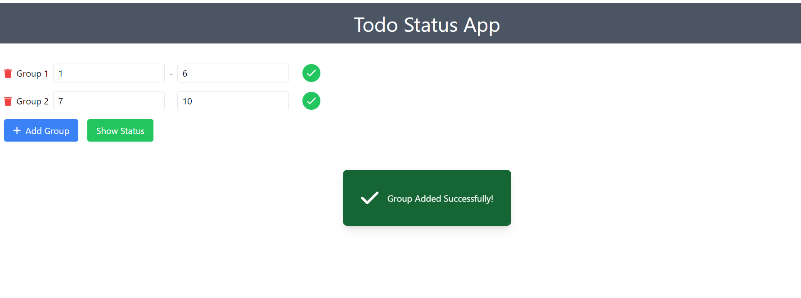

# Todo Status App

The Todo Status App is a React application designed to manage todo groups with assigned completion statuses. It allows users to add, update, delete groups, visualize completion statuses, and validate group configurations.

## Demo

Explore the live demo [here](https://thomascook-eta.vercel.app/).

## Table of Contents

- [Tech Stacks](#tech-stacks)
- [Features](#features)
- [Installation](#installation)
- [Preview](#preview)
- [Usage](#usage)
- [Unit Tests](#unit-tests)
- [Contributing](#contributing)

## Tech Stacks

- **Frontend:** React, Redux
- **Styling:** Tailwind CSS
- **Icons:** Font Awesome
- **State Management:** Redux Toolkit
- **Fetching Data:** axios

## Features
- Dynamic Group Management: Add, edit, and delete todo groups dynamically.
- Validation: Ensures groups are sequentially numbered without overlaps or gaps.
- Status Visualization: Clear visual indication of completion status within each group.
- Popup Notifications: Informative popups for successful group addition.
- The application is designed to be responsive across all screen sizes, including mobile, tablet, and desktop devices.

## Installation

### To run this project locally, follow these steps:

1. **Clone the repository:**

   ```bash
   git clone https://github.com/Sonali020200/thomascook.git
    ```

2. **Navigate to the project directory:**

    ```bash
    cd todo-status-app
    ```

3. **Install dependencies:**

    ```bash
    npm install
    ```

4. **Start the application:**

    ```bash
    npm start
    ```

5. **Open your browser:**

    Navigate to `http://localhost:3000` to view the app.


## Preview

### Mobile view


### Desktop views




## Usage

- **Adding Groups:** Click on "Add Group" button to add new todo groups.
- **Deleting Groups:** Remove a group by clicking the trash icon next to it.
- **Editing Group Range:** Modify the range of todo items in each group by adjusting the input fields.
- **Status Visualization:** Each group's completion status is visually represented with green (completed) or red (incomplete) backgrounds.
- **Popup Notification:** Shows a popup when a group is successfully added.

## Unit Tests

Unit tests are implemented for critical components and functionalities using Jest and React Testing Library.

To run tests, use the following command:

```bash
npm test
```

## Contributing

Contributions are welcome! Please fork the repository and submit a pull request.